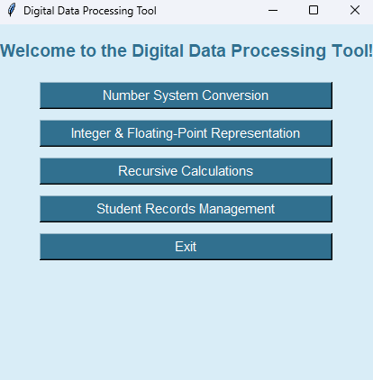

# Digital Data Processing Tool

As the name suggests, this tool brings together a range of features, including a number system converter, numeric representations, recursive calculations, and a student records manager — focusing mainly on fundamental concepts taught in the first year of a Computer Science degree.

This is my first experience working on a larger project of this scale and using the Tkinter library, so I’m open to any feedback, suggestions, or support you’d be willing to share. Thanks for checking it out!

## Usage

It’s very simple — just download the .exe file and run it. A window will open, and you’ll be ready to use the tool. Please note that some Windows antivirus programs may flag the .exe as a potentially harmful file, but this is a common false alarm for programs that aren’t digitally signed.

## Releases

File|Description
:---|:---
[Digital-Data-Processing-Tool](https://github.com/skylabneocat/Digital-Data-Processing-Tool/releases/download/v1.0.0/Digital.Data.Processing.Tool.exe)|Windows standalone x64 binary
